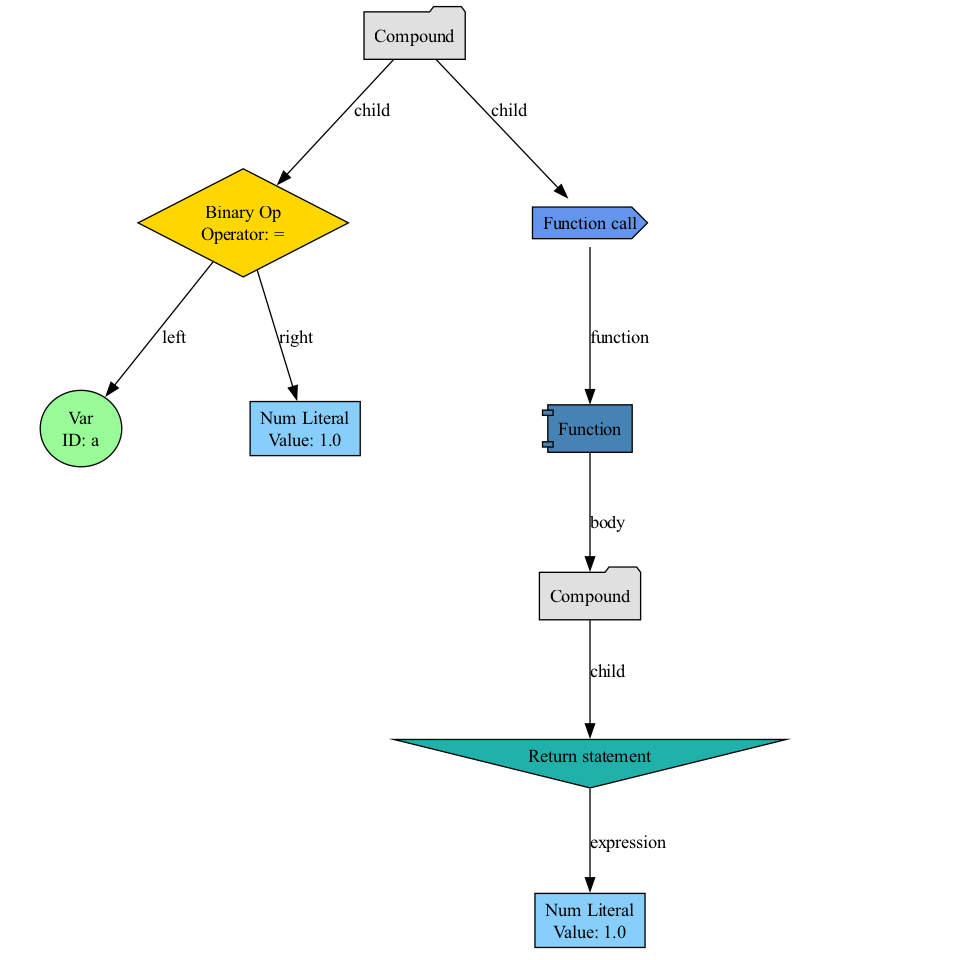
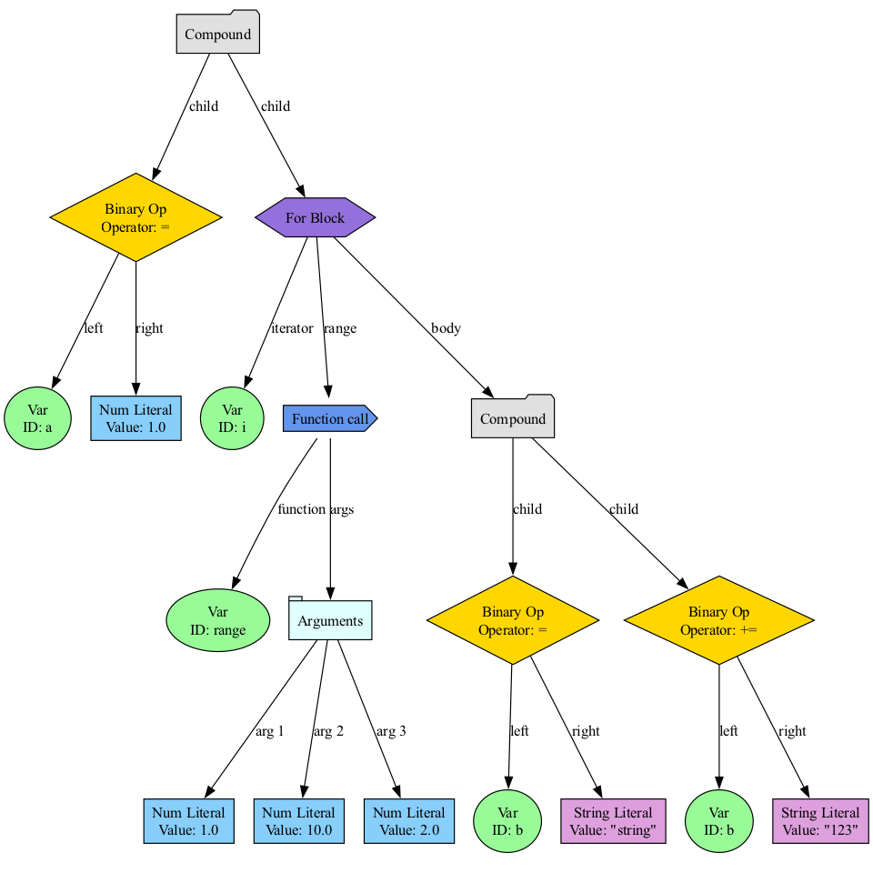

<div align="center">
  <h1>ITMO-Script</h1>
  <p><em>A sophisticated AST-based interpreter built on context-free grammar foundations</em></p>

  []()
  []()
  []()
  []()
</div>

## 📜 Overview

ITMO-Script is not just another interpreter — it is a meticulously crafted language environment that demonstrates the elegant marriage of theoretical computer science and practical software engineering. Built from the ground up with a focus on clean architecture, extensibility, and robust error handling, this project showcases advanced concepts in compiler design and language implementation.

The interpreter follows the classic pipeline of lexical analysis, parsing, and execution while introducing modern design patterns that make the codebase maintainable and extensible. Whether you're interested in learning how interpreters work or need a foundation for building your own programming language, ITMO-Script provides a comprehensive example of how to do it right.

## 🚀 Installation & Setup

### Prerequisites

Before diving into ITMO-Script, ensure your system meets these requirements:

- C++23 compatible compiler (GCC 11+, Clang 17+)
- CMake 3.12 or higher
- Python 3.6+ (for visualization tools)
- Git

### Building from Source

Clone the repository and build with these commands:

```bash
# Clone the repository
git clone https://github.com/axonde/itmo-script.git
cd itmo-script

# Create and enter build directory
mkdir build && cd build

# Configure the build
cmake ..

# Compile (using multiple cores for faster build)
make -j$(nproc)

# Run tests to verify installation
ctest -V
```

## 💡 Quick Start Guide

Let's explore ITMO-Script through examples to quickly understand its capabilities.

### Running Your First Script

Create a file named `hello.is`:

```
// My first ITMO-Script program
greet = function(name)
    return "Hello, " + name + "! Welcome to ITMO-Script."
end function

println(greet("Developer"))

// Variables and basic operations
counter = 10
while counter > 0
    println("Countdown: " + counter)
    counter = counter - 1
end while

println("Liftoff!")
```

Execute it:

```bash
./itmo-script path/to/hello.is
```

### Interactive Mode

Experiment with the language using the interactive REPL (Read-Eval-Print Loop):

```bash
./itmo-script

> x = 42
> y = 8
> print(x * y)
336
> fib = function(n)
... if n <= 1 then
... ... return n
    end if
    return fib(n - 1) + fib(n - 2)
end function
> print(fib(10))
55
> exit()
```

### Command Line Options

ITMO-Script offers several command-line options:

```bash
./itmo-script --help   # Display help information
./itmo-script --input  [input interpreter stream]
              --output [output interpreter stream]
              --error  [error interpreter stream]
              --file   path/to/script.its
```

`./itmo-srcipt` is default located as `./src/bin/itmoscript_interpreter`

For extra-tools look at ..

Some examples:


## 🏗️ Architecture Deep Dive

ITMO-Script implements a clean, layered architecture that separates concerns while maintaining flexibility. Let's explore each component:

### The Big Picture

```
┌───────────────────┐     ┌───────────────────┐     ┌───────────────────┐
│    Source Code    │────►│  Lexical Analysis │────►│  Syntax Analysis  │
└───────────────────┘     └───────────────────┘     └───────────────────┘
                                                             │
                                                             ▼
┌───────────────────┐     ┌───────────────────┐     ┌───────────────────┐
│  Runtime System   │◄────│    Interpreter    │◄────│   Abstract Syntax │
│  (Holder Packs)   │     │                   │     │   Tree (AST)      │
└───────────────────┘     └───────────────────┘     └───────────────────┘
        │                          ▲
        │                          │
        ▼                          │
┌───────────────────┐     ┌───────────────────┐
│  Memory Manager   │     │  Standard Library │
└───────────────────┘     └───────────────────┘
```

### 1. Lexical Analysis: The Tokenizer

The tokenizer transforms raw source text into a meaningful stream of tokens. This is the first step in understanding the structure of the program.

#### Token Classification

The tokenizer identifies various elements of the language:

| Token Type | Examples | Description |
|------------|----------|-------------|
| Keywords | `if`, `else`, `while`, `function` | Reserved words with special meaning |
| Identifiers | `variable_name`, `calculate` | Names defined by the programmer |
| Literals | `42`, `"text"`, `true` | Direct value representations |
| Operators | `+`, `-`, `*`, `/`, `==` | Symbols for operations |
| Delimiters | `(`, `)`, `[`, `]`, `,` | Symbols that structure the code |

#### Implementation Highlights

The tokenizer employs a state machine approach, making it both efficient and flexible:

```cpp
enum Tokens : uint16_t {
    // BASE
    T_EOF,                          // END OF FILE
    T_VAR,                          // `var`, `Var_Var`, `var__0`, `_var_`
    T_NUMBER,                       // 12, -123, 1.2e-12
    T_STRING,                       // "string"
    T_NIL,                          // `nil`

    // STATEMENTS
    T_THEN,                         // `then`
    T_IN,                           // `in`
    T_IF,                           // `if`
    T_ELSE_IF,                      // `else if`
    T_ELSE,                         // `else`
    T_END_IF,                       // `end if`
    ...
```

The tokenizer maintains positional information (line and column numbers) for precise error reporting, critical for a developer-friendly language environment.

### 2. Syntax Analysis: Building the AST

Once tokenized, the parser transforms the token stream into an Abstract Syntax Tree (AST) that represents the hierarchical structure of the program.

#### Grammar Foundation

ITMO-Script is defined by a context-free grammar that precisely specifies its syntax. Here's a simplified excerpt:

```
Var: T_VAR ( ('[' (Expr)? 1(':' | ':' (Expr)? 2(':' | ':' (Expr)? )? )? ) ']'
     | ('(' (expr (',' expr)* )? ')') )*
ListExpr: '[' (T_EOL)* (Expr (T_EOL)* (, (T_EOL)* Expr (T_EOL)*)* )? (,)? (T_EOL)* ']'
Factor: T_EOL* Number | String | Bool | Nil | VarExpr | ListExpr | FuncExpr
        | ('not' | '+' | '-') Factor
        | '(' expr ')'
Term: Factor (('*' | '/' | '%' | '^' | 'and') Factor)*
Expr: Term (('+' | '-' | 'or' | '==' | '!=' | '<' | '>' | '<=' | '>=') Term)*
Assignment: VarExpr ('=', '+=', '-=', '*=', '/=', '%=', '^=') Expr
BreakExpr: T_BREAK
ContinueExpr: T_CONTINUE
ReturnExpr: 'return' Expr
Statement: ReturnExpr | BreakExpr | ContinueExpr | Assignment | Expr
IfBlock: T_IF Expr T_THEN BLOCK (T_ELSE_IF Expr T_THEN BLOCK)* (T_ELSE BLOCK)? T_END_IF
ForBlock: T_FOR Expr T_IN Expr BLOCK T_FOR_END
WhileBlock: T_WHILE Expr BLOCK T_END_WHILE
FuncExpr: T_FUNC '(' (T_VAR (',' T_VAR)*)? ')' BLOCK T_END_FUNC
StatementList: IfBlock | WhileBlock | ForBlock | Statement
Block: (StatementList)? (T_EOL | StatementList)*
```

#### AST Visualization

Understanding complex programs is easier with visualization. ITMO-Script includes a Python tool to generate graphical representations of the AST:

You can run the Serializer program - it generates the AST from gave file in .json format
```bash
# Generate and AST Serialization (.json)
./src/interpreter/parser/serializer /path/to/scipt.is
```

On top of that, visualize itself by the visualizer:
```bash
# Generate an AST visualization
python ../src/interpreter/parser/serializer/visualizer.py /path/to/ast.json
```


```bash
# Generate an AST visualization
python tools/ast_visualizer.py examples/fibonacci.its --output fib_ast.png
```

This produces an image showing the hierarchical structure of your program, useful for debugging and educational purposes.





### 3. The Heart of Execution: Holder Pack System

The Holder Pack system is one of the most innovative aspects of ITMO-Script, providing sophisticated memory management and type operations.

#### Concept and Structure

```
┌─────────────────────────────────────────┐
│             Holder Pack                 │
├─────────────────┬───────────────────────┤
│   Type Metadata │       Value Data      │
├─────────────────┼───────────────────────┤
│     Type ID     │ • Raw memory block    │
│                 │ • Reference count     │
└─────────────────┴───────────────────────┘
```

Each value in ITMO-Script is wrapped in a Holder Pack that contains both the value itself and metadata about its type. This allows for:

1. **Dynamic typing with static type safety** - Type checking happens at runtime but with the rigor of a statically typed language
2. **Automatic memory management** - Reference counting and garbage collection happen transparently
3. **Polymorphic operations** - The same operation (like `+`) can behave differently based on types
4. **Value semantics with efficient implementation** - Values behave intuitively while optimizing memory usage

### 4. Operator System: Flexibility by Design

ITMO-Script features a modular operator system that makes it easy to extend the language with new operations.

#### Operator Registration

Operators are registered with the type system, specifying behavior for different operand types:

```cpp
// Registering the '+' operator for different type combinations
void registerUnaryOperators() {
    // + NUM
    UNARY_OP_TABLE[{Lexer::Tokens::T_PLUS, TYPES::NUM_TYPE}] = {
        [](auto&& arg) -> HolderPack {
            return {
                std::get<double>(arg->holder),
                TYPES::NUM_TYPE
            };
        }
    };

    // ...more operator registrations
}


void registerBinaryOperators() {
    // (not set type) = NUM
    BINARY_OP_TABLE[{Lexer::Tokens::T_EQUAL, TYPES::NOT_SET_TYPE, TYPES::NUM_TYPE}] = {
        [](auto&& arg_left, auto&& arg_right) -> HolderPack {
            if (!arg_left.IsRef()) { throw Errors::RunTime::AssignLiteral(); }
            *arg_left = *HolderPack(std::get<double>(arg_right->holder), TYPES::NUM_TYPE);
            return arg_left;
        }
    };

    // ...more operator registrations
}
```

This design makes it trivial to add new operators or extend existing ones to work with new types.

#### Supported Operators

ITMO-Script supports a rich set of operators:

| Category | Operators | Description |
|----------|-----------|-------------|
| Arithmetic | `+`, `-`, `*`, `/`, `%`, `^` | Basic math plus modulo and power |
| Comparison | `==`, `!=`, `<`, `>`, `<=`, `>=` | Value comparison |
| Logical | `and`, `or`, `not` | Boolean logic |
| Assignment | `=`, `+=`, `-=`, `*=`, `/=`, `%=`, `^=` | Variable assignment with shortcuts |

## 🔍 Language Features

ITMO-Script offers a powerful set of features that make it both expressive and practical:

### Strong Dynamic Typing

Variables are dynamically typed but strongly checked:

```
x = 5            // x is a number
x = "hello"      // x is now a string
x = x + 10       // TypeError: Cannot add string and number
```

### First-class Functions

Functions are first-class citizens that can be passed as arguments, returned from other functions, and stored in variables:

```
// Function as a value
add = function(a, b)
    return a + b;
end function

print(function(x) return x * 2 end function(3));  // Outputs: 6
```

### Comprehensive Control Flow

ITMO-Script provides all the control flow constructs you'd expect:

```
// If-else statements
if condition then
    // code
else if anotherCondition then
    // code
else
    // code
end if

// While loops
while condition
    // code
    if earlyExit then break end if
    if skipIteration then continue end if
end while

// For loops
for i in range(10)
    // code
end for
```

### Rich Standard Library

The standard library provides essential functionality:

```
// Math functions
print(Math.sqrt(16))       // 4
print(Math.abs(-2))        // 2

// String operations
text = "Hello, world!"
print(len(text))           // 13
print(text[0:5])           // "Hello"

// Arrays
arr = [1, 2, 3, 4, 5]
print(len(arr))            // 5
push(arr, 6)
print(arr[5])              // 6
```

For deep information you can take a look at [TASK.md](TASK.md)

## 🧪 Testing and Quality Assurance

ITMO-Script is built with a test-driven approach, ensuring reliability and correctness.

### Running Tests

Execute the test suite:

```bash
cd build/tests/
ctest -V                 # Run all tests with verbose output
```

### Coverage and Quality Metrics

ITMO-Script maintains rigorous quality standards:

- **90% test coverage** for critical components
- **Static analysis** with tools like clang-tidy and cppcheck
- **Memory leak detection** with Valgrind and sanitizers
- **Performance benchmarking** to prevent regressions

## 📚 Advanced Topics

### Extending the Language

Adding new features to ITMO-Script is straightforward due to its modular design:

1. **Adding new types** - Implement a new type class and register it with the type system
2. **Adding new operators** - Register new operator handlers in the operator registry
3. **Adding new built-in functions** - Add entries to the built-in function table
4. **Adding syntax features** - Extend the grammar and implement corresponding AST nodes

### Performance Optimization

ITMO-Script includes several optimizations:

- **Non-trivial types linking** - Complex types are always shared
- **Lazy evaluation** - Expressions are only evaluated when needed


## 📝 Future Directions

ITMO-Script is continuously evolving. Planned features include:

- **Module system** for better code organization
- **Closures** for better functional possibilities
- **Async/await** for asynchronous programming
- **Pattern matching** for more expressive conditionals
- **Type annotations** for optional static typing
- **Compiler** for generate and compile native code

## 🙏 Acknowledgements

This project stands on the shoulders of giants:

- Robert Nystrom's "Crafting Interpreters" for foundational concepts
- [Let's build a simple interpreter](https://ruslanspivak.com/lsbasi-part1/) by Ruslan Spivak
- The LLVM project for inspiration on modularity
- The ITMO University faculty for theoretical foundations

## 🤝 Contributing

Contributions are welcome!

---

<div align="center">
  <p>Designed and implemented with ❤️ by <a href="https://github.com/axonde">axonde</a></p>
</div>
